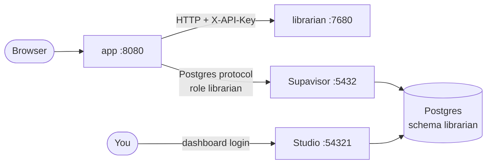

# Setup

How to run Librarian with its database in self-hosted Supabase: first on your
own machine, then in production on SciLifeLab Serve.

## What runs where

| Part | Folder | Local address | What it does |
|---|---|---|---|
| **app** | `app/` | <http://localhost:8080> | Web UI and its API. Calls librarian over HTTP, and keeps its data in Postgres. |
| **librarian** | `librarian/` | <http://localhost:7680> | EMBL's Librarian, unchanged. |
| **Supabase** | `postgres-db/docker/` | <http://localhost:54321> | Postgres, the Studio dashboard and Supabase's own APIs. |
| Postgres | (in Supabase) | `localhost:5432` | Connection pooler (Supavisor) in session mode. `6543` is transaction mode. |



The app logs in as its own role, `librarian`, and its tables live in the schema
`librarian`, not in `public`. Supabase's REST API serves `public` to anyone
who holds the anon key, and the `users` table holds password hashes.
`librarian` can reach only its own schema. The Studio login (`postgres`) is a
member of the role, so Studio can view and edit the tables.

## Local setup

You need Docker (Docker Desktop on macOS) and `openssl`. Run every command from
the repository root unless a step says otherwise.

### 1. Configure Supabase

Only `postgres-db/docker/` is used from the Supabase clone.

```bash
cd postgres-db/docker
cp .env.example .env
sh utils/generate-keys.sh --update-env   # new secrets, API keys and passwords
sh run.sh config add librarian           # adds docker-compose.librarian.yml to COMPOSE_FILE
echo "LIBRARIAN_DB_PASSWORD=$(openssl rand -hex 24)" >> .env
```

Then edit these values in `postgres-db/docker/.env`:

```bash
DASHBOARD_USERNAME=<your Studio login name>
POOLER_TENANT_ID=librarian-db
API_GW_HTTP_PORT=54321              # 8000 is where a local LLM server usually listens
SUPABASE_PUBLIC_URL=http://localhost:54321
API_EXTERNAL_URL=http://localhost:54321/auth/v1
```

> [!IMPORTANT]
> - Keep `docker-compose.librarian.yml` in `COMPOSE_FILE`, and check it with `sh run.sh config show`. It stores Postgres data in the named volume `db-data`, not in the bind mount `volumes/db/data`. On macOS that bind mount can't be owned by the `postgres` user, so Postgres never initializes, and every service then fails with `password authentication failed`. The override also creates the `librarian` role and schema.
> - `ANON_KEY` and `SERVICE_ROLE_KEY` are JWTs signed with `JWT_SECRET`. If you change `JWT_SECRET`, run `generate-keys.sh` again rather than editing one of them by hand. Leave `SUPABASE_PUBLISHABLE_KEY` and `SUPABASE_SECRET_KEY` empty, or generate them with `sh utils/add-new-auth-keys.sh`. Librarian doesn't use them.
> - Passwords and the role are set only when the database is **first** created. Changing `POSTGRES_PASSWORD` or `LIBRARIAN_DB_PASSWORD` afterwards doesn't change them. That includes redoing this step on a fresh `.env` while `db-data` still exists. Use `sh utils/db-passwd.sh` for the first, and `alter role librarian password '…'` in Studio's SQL editor for the second. See [Services fail with `password authentication failed`](#services-fail-with-password-authentication-failed).

### 2. Start Supabase

```bash
cd postgres-db/docker
docker compose up -d --wait        # waits until all 11 containers are healthy
```

Open Studio at <http://localhost:54321>. Log in with `DASHBOARD_USERNAME` and
`DASHBOARD_PASSWORD`, then open **Table Editor** and pick the schema
**librarian**. The tables appear after the app's first start (step 4).

### 3. Configure the two services

```bash
cp librarian/.env.example librarian/.env
cp app/.env.example app/.env
```

- **API key:** set `API_KEY` in `librarian/.env` and the same value as `LIBRARIAN_API_KEY` in `app/.env`. Generate it with `openssl rand -hex 32`.
- **LLM:** set `LLM_BASE_URL`, `LLM_MODEL` and `LLM_API_KEY` in `librarian/.env`.
- **Database:** set `DATABASE_URL` in `app/.env`. The values come from `postgres-db/docker/.env`:

  ```bash
  DATABASE_URL=postgresql://librarian.<POOLER_TENANT_ID>:<LIBRARIAN_DB_PASSWORD>@host.docker.internal:5432/postgres
  ```

  The user name is `librarian.<POOLER_TENANT_ID>`, because the pooler reads the tenant from it. Percent-encode any `:/@?#` in the password.

### 4. Build and run

```bash
docker build -t librarian librarian/
docker build -t librarian-app app/

docker run -d --name librarian --env-file librarian/.env -p 127.0.0.1:7680:7680 librarian

docker run -d --name app --env-file app/.env -p 8080:8080 \
    -e LIBRARIAN_URL=http://host.docker.internal:7680 \
    --add-host=host.docker.internal:host-gateway \
    librarian-app
```

At startup the app migrates the schema to the latest version. Its log line
`Database postgresql+psycopg://librarian.… is at the latest schema` confirms
that it reached Postgres. If the database is down, the app still starts,
answers requests that need the database with "The database service is
unavailable", and connects once the database is back. Then open
<http://localhost:8080>.

### Useful commands

| Task | Command |
|---|---|
| Did the app reach Postgres? | `docker logs app 2>&1 \| grep -E "latest schema\|Database call failed"` |
| psql as the app's role | `docker exec -it supabase-db psql "host=supavisor user=librarian.librarian-db dbname=postgres"` |
| Back up the data | `docker exec supabase-db pg_dump -U supabase_admin -d postgres --schema=librarian > librarian-backup.sql` |
| Run the app's tests | `cd app && uv run python -m pytest` |
| Stop Supabase, keeping the data | `cd postgres-db/docker && docker compose down` |
| Delete **all** Supabase data | `cd postgres-db/docker && docker compose down -v` (removes `db-data`) |

`reset.sh` doesn't know about the `db-data` volume and leaves it in place. Use
`docker compose down -v` to wipe it.

The app's tests run on a temporary SQLite file. To run the database tests on
Postgres, set `TEST_DATABASE_URL` to a **throwaway** database, because they
empty every table: `TEST_DATABASE_URL=postgresql://… uv run python -m pytest tests/test_db_client.py`.

### Connection strings

| For | Connection string |
|---|---|
| The app, or any client for Librarian's data | `postgresql://librarian.librarian-db:<LIBRARIAN_DB_PASSWORD>@localhost:5432/postgres` |
| Admin tools (DBeaver, pg_dump from the host) | `postgresql://postgres.librarian-db:<POSTGRES_PASSWORD>@localhost:5432/postgres` |

The app accepts `postgresql://` and `postgres://` URLs as Supabase prints them,
and uses the psycopg 3 driver for both.

### Services fail with `password authentication failed`

`supabase-auth`, `supabase-rest` and `supabase-storage` keep restarting, and
their logs show `password authentication failed for user
"supabase_auth_admin"` (SQLSTATE `28P01`), while `supabase-db` is healthy.
There are two causes:

1. **Postgres never initialized.** `docker-compose.librarian.yml` is missing from `COMPOSE_FILE`, so the data sits in the bind mount. Check it with `sh run.sh config show` (step 1).
2. **`.env` changed after the database was created.** The database keeps the passwords from its first start. A fresh `.env` (`cp .env.example .env` and `generate-keys.sh` again) gives every service a new `POSTGRES_PASSWORD`, which the database has never seen.

To check the second cause, log in with the password from `.env`. It prints
`1` if the password matches:

```bash
docker exec supabase-db sh -c 'PGPASSWORD="$POSTGRES_PASSWORD" psql -h "$(hostname -i | cut -d" " -f1)" -U supabase_auth_admin -d postgres -tAc "select 1"'
```

`-h` is the container's own address, because logins from `127.0.0.1` skip the
password check.

If it fails, reset the passwords and keep the data. Don't run
`docker compose down -v`, which deletes it.

```bash
cd postgres-db/docker
sh utils/db-passwd.sh                          # asks first, then writes a new POSTGRES_PASSWORD to .env
docker compose up -d --force-recreate --wait
```

The script needs an interactive terminal. It sets the new password on every
Supabase role, and clears the pooler's stored tenant (schema `_supavisor`),
which still holds the old password.

It doesn't touch the `librarian` role. The password that counts for that role
is the one in the app's `DATABASE_URL`. If the app can't log in, set the role's
password to that value, and put the same value in `LIBRARIAN_DB_PASSWORD` in
`postgres-db/docker/.env`:

```bash
docker exec -it supabase-db psql -U supabase_admin -d postgres -c "alter role librarian password '<password from DATABASE_URL>'"
```

## Production ongoing 

Each service gets its own address, `https://[service].scilifelab.serve.se/`.
The examples below use these names; pick your own:

| Service | Example address |
|---|---|
| app | `https://librarian.scilifelab.serve.se` |
| librarian | `https://librarian-core.scilifelab.serve.se` |
| Supabase (Studio) | `https://librarian-supabase.scilifelab.serve.se` |

### URLs to replace

| File | Variable | Local | Production |
|---|---|---|---|
| `app/.env` | `LIBRARIAN_URL` | `http://host.docker.internal:7680` | `https://librarian-core.scilifelab.serve.se` |
| `app/.env` | `DATABASE_URL` | `postgresql://librarian.librarian-db:…@host.docker.internal:5432/postgres` | `postgresql://librarian.librarian-db:…@<postgres-host>:5432/postgres` (see below) |
| `postgres-db/docker/.env` | `SUPABASE_PUBLIC_URL` | `http://localhost:54321` | `https://librarian-supabase.scilifelab.serve.se` |
| `postgres-db/docker/.env` | `API_EXTERNAL_URL` | `http://localhost:54321/auth/v1` | `https://librarian-supabase.scilifelab.serve.se/auth/v1` |
| `postgres-db/docker/.env` | `SITE_URL` | `http://localhost:3000` | `https://librarian.scilifelab.serve.se` |
| `librarian/.env` | `LLM_BASE_URL` | your LLM endpoint | your hosted LLM's `/v1` endpoint |

`LIBRARIAN_URL` can end with or without `/`. The app already trusts the proxy's
`X-Forwarded-Proto`, so behind Serve's HTTPS it marks the session cookie
`Secure` by itself.

### The database address is not an HTTPS URL (discuss more with Serve)

`DATABASE_URL` speaks the Postgres protocol over TCP, not HTTP. An HTTPS
address like `https://librarian-supabase.scilifelab.serve.se` can serve Studio,
but it can't carry the app's database connection. `<postgres-host>` must be a
host name or IP address where port `5432` of the Supabase machine can be
reached from the app's container.

Before deploying, ask the Serve team whether an app on Serve can open a TCP
connection to `<postgres-host>:5432`, and from which IP addresses.

The Supabase stack is a Docker Compose project of 11 containers, so it needs a
machine that can run `docker compose`, for example a VM. On that machine:

1. Put HTTPS in front of the gateway for Studio. Supabase ships a Caddy override: set `PROXY_DOMAIN` in `.env`, then run `sh run.sh config add caddy`.
2. Open ports `5432` (and `6543`, if you use it) only to the addresses the app connects from. Compose publishes them on every interface by default.

### Before going live

- [ ] Generate **new** secrets for production. Run `generate-keys.sh` on a fresh `.env`, and use a new `LIBRARIAN_DB_PASSWORD`. Never reuse the local ones.
- [ ] Give `DASHBOARD_PASSWORD` its own strong value, different from `POSTGRES_PASSWORD`.
- [ ] Set `API_KEY` in `librarian/.env`, and the same value as `LIBRARIAN_API_KEY` in `app/.env`. Without it, anyone who reaches the librarian can spend your LLM credits.
- [ ] Keep Librarian's tables in the `librarian` schema, logged in as the `librarian` role, never in `public`.
- [ ] Schedule backups with the `pg_dump` command above.

To bring the local data along, restore the dump into the production database
as `supabase_admin`, **before** the app's first start there:

```bash
docker exec -i supabase-db psql -U supabase_admin -d postgres < librarian-backup.sql
```

Expect one `ERROR: schema "librarian" already exists`. The init script already
created the schema, and everything else restores normally.
