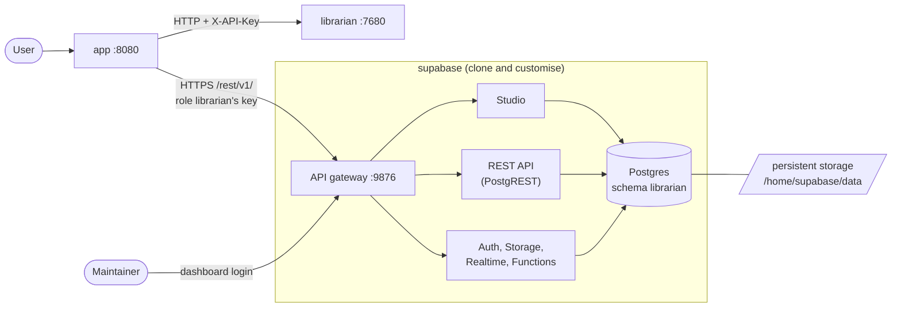

# A hosted instance of EMBL's Librarian at SciLifeLab Serve

> [!IMPORTANT]
> This is a private repository. I did not make a fork or a branch because I was not sure that is what we want at the end. It will be made public later.

> Our goal is to host an instance of EBML's Librarian on SciLifeLab Serve platform, with our locally hosted LLM and a user-friendly interface.


## Overview

Starting from the original Librarian repository, we built 3 services, with one per dir. Each of the 3 has its own `Dockerfile` and runs as a container of its own. They talk to each other only through their API (see figure below).

| Part | Folder | Port | Role |
|---|---|---|---|
| **app** | `app/` | 8080 | The web UI (login, questions, history) and the API it calls. Sends questions to librarian and stores everything in the database. |
| **librarian** | `librarian/` | 7680 | The EMBL's Librarian, unchanged |
| **supabase** | `postgres-db/` | 9876 | Self-hosted Supabase of both dashboard Studio and database. The app reaches its tables through the REST API, on the same port as Studio. |




Details about the Supabase docker container can be found at the bottom. 


## Quick start

### Step 1: Configure the three containers

```bash
cp postgres-db/.env.example postgres-db/.env
cp librarian/.env.example librarian/.env
cp app/.env.example app/.env


(cd postgres-db && sh utils/generate-keys.sh --update-env) # generate every Supabase secret

(cd postgres-db && sh utils/librarian-key.sh)              # the app's two keys: paste into app/.env
```

- **Supabase:** in `postgres-db/.env`, set `DASHBOARD_USERNAME` (your Studio login name). `generate-keys.sh` has already set `DASHBOARD_PASSWORD`, `POSTGRES_PASSWORD` and the rest.
- **API keys:** set `API_KEY` in `librarian/.env` and the same value as `LIBRARIAN_API_KEY` in `app/.env`. Generate it with `openssl rand -hex 32`.
- **LLM:** set `LLM_BASE_URL`, `LLM_MODEL` and `LLM_API_KEY` in `librarian/.env`.
- **Database:** paste the two lines that `librarian-key.sh` printed, `SUPABASE_ANON_KEY` and `SUPABASE_LIBRARIAN_KEY`, into `app/.env`. `SUPABASE_URL` there is already the gateway, as the app's container sees it:

  ```bash
  SUPABASE_URL=http://host.docker.internal:9876
  ```


### Step 2: Build the images

```bash
docker build -t librarian-supabase:latest postgres-db/
docker build -t librarian:latest librarian/
docker build -t librarian-app:latest app/
```

### Step 3: Run the containers

Each in a terminal of its own:

```bash
docker run --rm -it -p 9876:9876 --env-file postgres-db/.env librarian-supabase:latest
docker run --rm -it -p 7680:7680 --env-file librarian/.env librarian:latest
docker run --rm -it -p 8080:8080 --env-file app/.env librarian-app:latest
```

Note: Ctrl+C stops a container, and `--rm` then deletes it, with its data.


### Step 4: Access the app and database
- Open <http://localhost:9876> for the database dashboard Studio. Log in with `DASHBOARD_USERNAME` and
`DASHBOARD_PASSWORD` in `postgres-db/.env`
- Open <http://localhost:8080> for the app GUI.


---
# Optional reading
## Details on Supabase container

`postgres-db/` runs the 11 services of Supabase's
[`docker-compose.yml`](https://github.com/supabase/supabase/tree/master/docker) in one container. `supervisord` starts them all,
restarts any that stops, and stops them in order.

| Service | Image | Port inside | Reached through |
|---|---|---|---|
| db (Postgres) | `supabase/postgres:17.6.1.136` | 5432 | published port |
| gateway (Envoy) | `envoyproxy/envoy:v1.39.1` | 9876 | published port |
| studio | `supabase/studio:2026.09.07-sha-7996410` | 3000 | gateway, `/` |
| rest (PostgREST) | `postgrest/postgrest:v14.17` | 3001 | gateway, `/rest/v1/` |
| auth (GoTrue) | `supabase/gotrue:v2.196.0` | 9999 | gateway, `/auth/v1/` |
| realtime | `supabase/realtime:v2.134.10` | 4000 | gateway, `/realtime/v1/` |
| storage | `supabase/storage-api:v1.74.0` | 5000 | gateway, `/storage/v1/` |
| imgproxy | `darthsim/imgproxy:v3.31.4` | 5001 | storage |
| meta (postgres-meta) | `supabase/postgres-meta:v0.99.0` | 8080 | Studio, gateway `/pg/` |
| functions (edge runtime) | `supabase/edge-runtime:v1.76.2` | 9000 | gateway, `/functions/v1/` |
| pooler (Supavisor) | `supabase/supavisor:2.9.12` | 5433, 6543 | published ports |

| File | What it does |
|---|---|
| `Dockerfile` | Copies each service out of its image onto Debian 13, creates the user `supabase` (id 1000), and fixes where the data goes. |
| `start-script.sh` | Starts the container: checks the settings, prepares the data folder, then runs `supervisord`. |
| `supervisord.conf` | The 11 services, their start order and how each is stopped. |
| `services/*.sh` | One script per service: the environment `docker-compose.yml` gives it, with every other service on `127.0.0.1`. |
| `healthcheck.sh` | Checks each service the way its compose healthcheck did. |
| `config/` | The gateway's routes (`envoy/`), the database init scripts (`db/`) and the pooler's tenant (`pooler.exs`), from Supabase's `volumes/`. |
| `config/librarian/` | The tables of Librarian's app, one numbered SQL file per change. `services/schema.sh` applies new ones at each start. |
| `functions/` | The edge functions, served from `/home/deno/functions`. |
| `utils/generate-keys.sh` | Supabase's script that generates every secret in `.env`. |
| `utils/librarian-key.sh` | Prints the app's two keys, for `app/.env`. |
| `.env.example` | The settings to set on the container: the secrets and the URLs. Copy it to `postgres-db/.env`, for `docker run --env-file`. |
| `settings.env` | Every other setting, which the image includes. A variable set on the container wins over its line. |


### Persistence volume

| Path in the container | What it is |
|---|---|
| `/home/supabase/data` | `DATA_DIR`: the folder to mount persistent storage on. |
| `/home/supabase/data/pgdata` | `PGDATA`: Postgres's data files, the whole database. |
| `/home/supabase/data/postgresql-custom` | Postgres's custom config, and pgsodium's root key. `/etc/postgresql-custom` links here. |
| `/home/supabase/data/storage` | The files uploaded to Storage. |
| `/home/supabase/data/snippets` | Studio's saved SQL snippets. |

Mount the storage on `/home/supabase/data`. 

### The role and the schema

The app reaches tables through the REST API (PostgREST, at `/rest/v1/` on the
gateway), as the role `librarian`. That is the gateway's HTTP port, the one
port a Serve app publishes. Each request carries two keys, which
`utils/librarian-key.sh` prints for `app/.env`:

| Header | Setting in `app/.env` |
|---|---|
| `apikey` | `SUPABASE_ANON_KEY` |
| `Authorization: Bearer` | `SUPABASE_LIBRARIAN_KEY` |


### Look at the data

Open Studio at <http://localhost:9876> and log in. In **Table Editor**, pick the schema **librarian**.

Or through the REST API, as the app does, with the keys from `app/.env`:

```bash
curl "http://localhost:9876/rest/v1/users?select=id,email,created_at" \
    -H "apikey: $SUPABASE_ANON_KEY" -H "Authorization: Bearer $SUPABASE_LIBRARIAN_KEY" \
    -H "Accept-Profile: librarian"
```

Or with any Postgres client (DBeaver, TablePlus, pgAdmin) on your machine, as
an admin, when the container publishes port 5432:
`postgresql://postgres:<POSTGRES_PASSWORD>@localhost:5432/postgres`.

### Changing a password

The database keeps the passwords from its first start -> Changing
`POSTGRES_PASSWORD` in `postgres-db/.env` afterwards changes nothing in it,
and the services then fail.

Change the password in the database first, then in `postgres-db/.env` (or the
platform's settings), and recreate the container:

```bash
# POSTGRES_PASSWORD: every role that Supabase's services log in as
docker exec supabase psql -U supabase_admin -d postgres \
    -c "alter role postgres password '<new>'" \
    -c "alter role supabase_admin password '<new>'" \
    -c "alter role authenticator password '<new>'" \
    -c "alter role pgbouncer password '<new>'" \
    -c "alter role supabase_auth_admin password '<new>'" \
    -c "alter role supabase_functions_admin password '<new>'" \
    -c "alter role supabase_storage_admin password '<new>'"
```

The pooler picks up a new `POSTGRES_PASSWORD` by itself on its next start.

The app's key, `SUPABASE_LIBRARIAN_KEY`, stays valid for 5 years, or until
`JWT_SECRET` changes. A new `JWT_SECRET` also needs new `ANON_KEY` and
`SERVICE_ROLE_KEY`, which are signed with it. Then run `librarian-key.sh`
again, put its output in `app/.env` (or the platform's settings), and restart
both containers.

If `supabase` stops at once with `Not set: …`, the container was started
without those settings: pass `--env-file postgres-db/.env`, or set them on the
platform.


