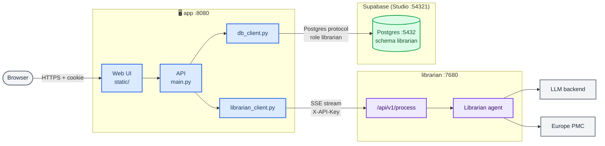

# Librarian on SciLifeLab Serve Platform

> [!IMPORTANT]
> This is a private repository. I did not make a fork or a branch because I was not sure that is what we want at the end. It will be made public later.

> Our goal is to host an instance of EBML's Librarian on SciLifeLab Serve platform, with our locally hosted LLM and a user-friendly interface.

## Overview

Starting from the original Librarian repository, we built two services, one per folder, next to a self-hosted Supabase for the data. Each service has its own Docker image and runs on its own. The two talk to each other only through APIs, and the app reaches the database with a Postgres connection string.

| Part          | Port | Role |
|---------------|------|------|
| **app**       | 8080 | The web UI (login, questions, history) and the API it calls. Sends questions to librarian and stores everything in Supabase's Postgres. |
| **librarian** | 7680 | The EMBL's Librarian, unchanged |
| **Supabase**  | 5432 (Postgres), 54321 (Studio) | Self-hosted Supabase in `postgres-db/docker/`: the Postgres database, and the Studio dashboard to manage it. |

See [SETUP.md](SETUP.md) for the local and production setup. The app graph is shown below:



## Run it
These are the short steps; [SETUP.md](SETUP.md) has the details, and what to change for production.

### Step 0:
Start the database: configure and run Supabase in `postgres-db/docker/`, as in [SETUP.md](SETUP.md#local-setup) steps 1 and 2.

### Step 1:
Each service reads its configuration from its own `.env` file. Every variable is listed, with comments, in that folder's `.env.example`.

```bash
# Clone repo and go to cloned folder
git clone https://github.com/pharmbio/serve-librarian.git
cd serve-librarian 

# Copy environment file example and make to be real .env by filling in some fields (read each .env file for details)
cp librarian/.env.example librarian/.env
cp app/.env.example app/.env
```

Then:
- set `API_KEY` in `librarian/.env` and the same value as `LIBRARIAN_API_KEY` in `app/.env`, to protect the librarian's API. Generate it with `openssl rand -hex 32` or any alternative you want. If you leave it empty, the API accepts any caller that reaches it. This is fine for localhost, but not good for production hosting.
- set `DATABASE_URL` in `app/.env` to Supabase's Postgres, as the `librarian` role (see `app/.env.example`).

### Step 2:
Build each image separately:

```bash
docker build -t librarian librarian/
docker build -t librarian-app app/
```
### Step 3:
Then start the containers, in any order. app starts even when the librarian or the database isn't up yet: until they are, requests that need them fail with a message saying which one is down.

```bash
# Run librarian server
docker run -d --name librarian --env-file librarian/.env -p 127.0.0.1:7680:7680 librarian

# Run the app server
docker run -d --name app --env-file app/.env -p 8080:8080 \
    -e LIBRARIAN_URL=http://host.docker.internal:7680 \
    --add-host=host.docker.internal:host-gateway \
    librarian-app
```

These local host urls will be replace by the proper urls when hosting on Serve.

### Step 4

Open <http://localhost:8080> and create an account and use it.


## The APIs

**app**: `/api/auth/{register,login,logout}`, `/api/me`, `POST /run-agent` (blocking) and `POST /run-agent/stream` (Server-Sent Events: `progress`, `queries`, `evidence`, then `result` or `error`, then `done`), and `/api/users/{user_id}/runs[/{run_id}]` for the history. `POST /run-agent` returns this payload, and the stream's `result` event carries it:

```json
{
  "answer": "## Executive Summary …",
  "evidence": {
    "query": "Does metformin extend lifespan in mammals?",
    "search_queries": ["…", "…"],
    "papers": [
      {
        "citation_key": "Keys 2025",
        "title": "…",
        "authors": "…",
        "journal": "…",
        "year": "2025",
        "pmid": "…",
        "doi": "…",
        "url": "…",
        "has_fulltext": true,
        "evidence_snippets": ["…"],
        "…": "…"
      }
    ]
  },
  "run_id": "9284917e4f4ad7e1"
}
```

**librarian**: `POST /api/v1/process` takes `{"query": "…", "full_text_enrichment": true}` and returns `{answer, evidence}` as above, without `run_id`. `POST /api/v1/process/stream` streams the same events as app's stream. Both return a 503 when the librarian is busy. `GET /health` is the liveness probe.

**Database**: the app keeps four tables in the schema `librarian` of Supabase's Postgres: `users`, `sessions` (keyed by a hash of the cookie token), `queries`, and `runs` (each processing of a query, with its answer and evidence). They are defined in `app/models.py`, and the app migrates them at startup (`app/migrations/`). You can view and edit them in Studio's Table Editor.
