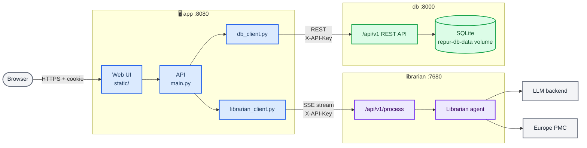

# Librarian on SciLifeLab Serve Platform

> [!IMPORTANT]
> This is a private repository. I did not make a fork or a branch because I was not sure that is what we want at the end. It will be made public later.

> Our goal is to host an instance of EBML's Librarian on SciLifeLab Serve platform, with our locally hosted LLM and a user-friendly interface.

## Overview

Starting from the original Librarian repository, we built three services, one per folder. Each has its own Docker image and runs on its own, and they talk to each other only through APIs. 

| Service     | Port | Role |
|-------------|------|------|
| **app**         | 8080 | The web UI (login, questions, history) and the API it calls. Sends questions to librarian and stores everything through db. |
| **librarian**   | 7680 | The EMBL's Librarian, unchanged | 
| **db**          | 8000 | Owns persistence data (SQLite) and serves it as a REST API under `/api/v1`.| 

The app graph is shown below:



## Run it
### Step 1:
Each service reads its configuration from its own `.env` file. Every variable is listed, with comments, in that folder's `.env.example`.

```bash
# Clone repo and go to cloned folder
git clone https://github.com/pharmbio/serve-librarian.git
cd serve-librarian 

# Copy environment file example and make to be real .env by filling in some fields (read each .env file for details)
cp db/.env.example db/.env
cp librarian/.env.example librarian/.env    
cp app/.env.example app/.env
```

To protect the internal APIs:
- set `API_KEY` in `db/.env` and the same value as `DB_API_KEY` in `app/.env`. 
- set `API_KEY` in `librarian/.env` with `LIBRARIAN_API_KEY` in `app/.env`. 
- Generate each with `openssl rand -hex 32` or any alternative you want. The API_keys of the correspoding services have to match each other.
- If you leave them empty, the APIs accept any caller that reach them. This is fine for localhost, by not good for production hosting.

### Step 2:
Build each image separately:

```bash
docker build -t librarian-db db/
docker build -t librarian librarian/
docker build -t librarian-app app/
```
### Step 3:
Then start the containers, in any order. app starts even when the others aren't up yet: until they are, requests that need them fail with a message saying which service is down.

```bash
# Run database server
docker run -d --name db --env-file db/.env -v repur-db-data:/data -p 127.0.0.1:8000:8000 librarian-db

# Run librarian server
docker run -d --name librarian --env-file librarian/.env -p 127.0.0.1:7680:7680 librarian

# Run the app server
docker run -d --name app --env-file app/.env -p 8080:8080 \
    -e LIBRARIAN_URL=http://host.docker.internal:7680 \
    -e DB_URL=http://host.docker.internal:8000 \
    --add-host=host.docker.internal:host-gateway \
    librarian-app
```

These local host urls will be replace by the proper urls when hosting on Serve.

### Step 4

Open <http://localhost:8080> and create an account and use it.


## The APIs

**app**: `/api/auth/{register,login,logout}`, `/api/me`, `POST /run-agent` (blocking) and `POST /run-agent/stream` (Server-Sent Events: `progress`, `queries`, `evidence`, then `result` or `error`, then `done`), and `/api/users/{user_id}/runs[/{run_id}]` for the history. `POST /run-agent` returns this payload, and the stream's `result` event carries it:

```json
{
  "answer": "## Executive Summary …",
  "evidence": {
    "query": "Does metformin extend lifespan in mammals?",
    "search_queries": ["…", "…"],
    "papers": [
      {
        "citation_key": "Keys 2025",
        "title": "…",
        "authors": "…",
        "journal": "…",
        "year": "2025",
        "pmid": "…",
        "doi": "…",
        "url": "…",
        "has_fulltext": true,
        "evidence_snippets": ["…"],
        "…": "…"
      }
    ]
  },
  "run_id": "9284917e4f4ad7e1"
}
```

**librarian**: `POST /api/v1/process` takes `{"query": "…", "full_text_enrichment": true}` and returns `{answer, evidence}` as above, without `run_id`. `POST /api/v1/process/stream` streams the same events as app's stream. Both return a 503 when the librarian is busy. `GET /health` is the liveness probe.

**db**: `GET /health` (liveness) and `GET /ready` (the database answers), plus under `/api/v1`:

| Resource | Endpoints |
|---|---|
| users | `POST /users` (409 if the email is taken), `GET /users/{id}`, `POST /users/lookup` (by email, with the password hash) |
| sessions | `POST /sessions`, `GET /sessions/{token_hash}`, `DELETE /sessions/{token_hash}` |
| queries | `POST /queries`, `GET /queries/{id}`, `GET /queries?user_id=&created_after=&created_before=&limit=&offset=`, `DELETE /queries/{id}` (with its runs) |
| runs | `POST /runs`, `GET /runs/{id}`, `PATCH /runs/{id}` (status and output; 409 on an illegal status change), `GET /runs?query_id=&user_id=&status=&created_after=&created_before=&limit=&offset=` |

Every error has the body `{"error": {"code": "not_found", "message": "…", "details": null}}`.
