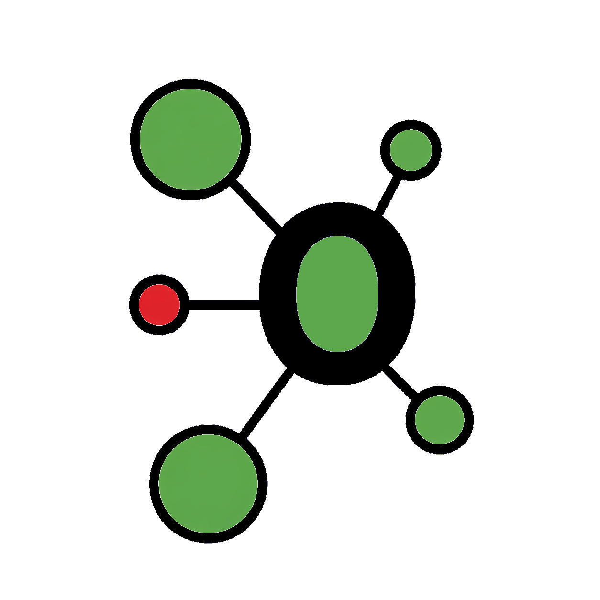
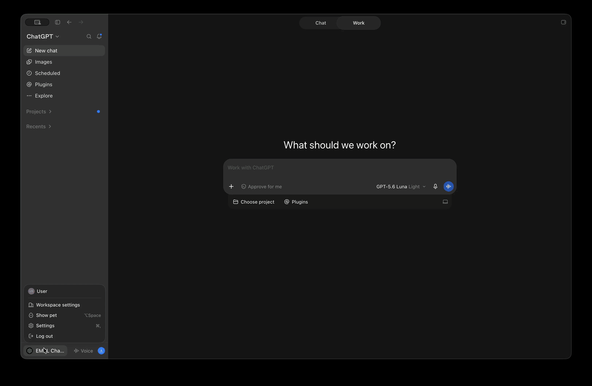
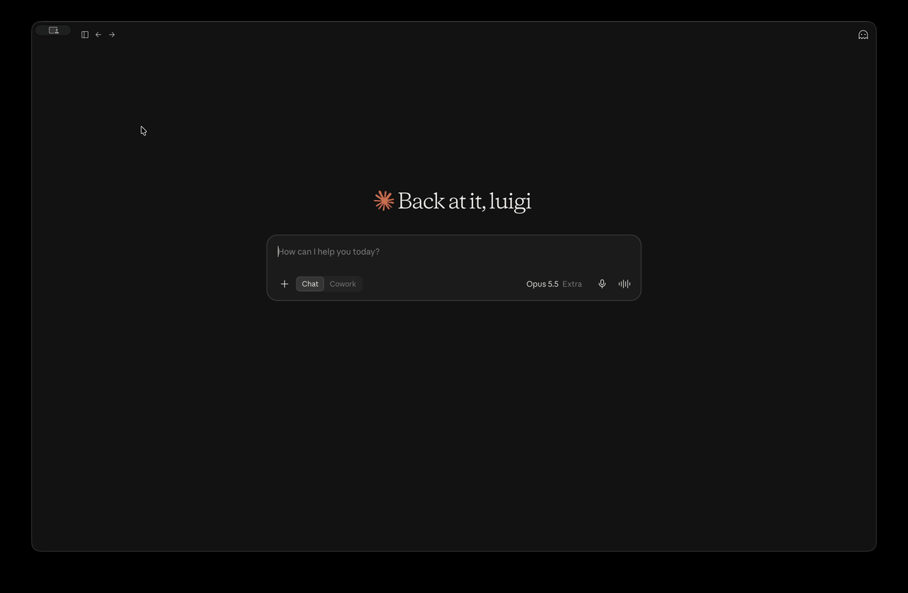
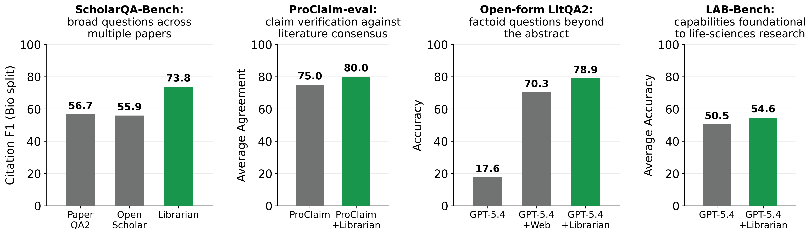
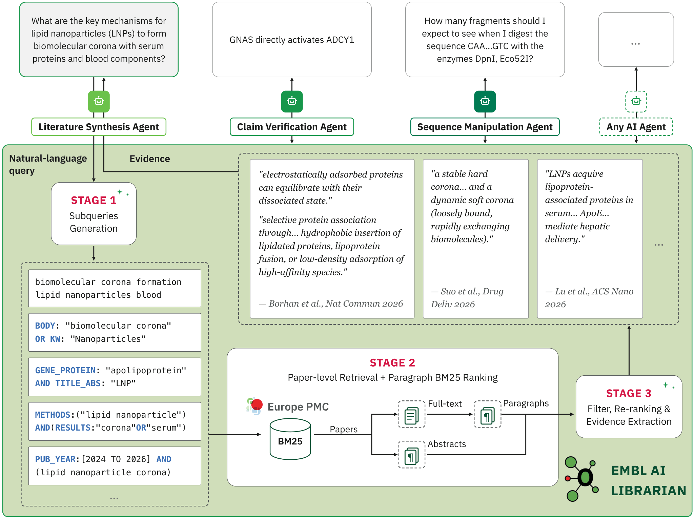

<div align="center">



<h1><span style="color:#18974C">EMBL AI Librarian</span></h1>

<h3>A life-sciences knowledge layer for AI agents</h3>

<!-- TODO: project page, once one exists
<h4><a href="https://your-project-page.example">Project Page 🚀</a></h4>
-->

<!--
  TODO: capture a real run and drop it here as assets/demo.gif or assets/teaser.png
  (e.g. a terminal recording of `uv run main.py "<question>"` showing the spinner
  stages and the final ranked evidence passages).
-->
<!--  -->

[](https://arxiv.org/abs/2607.28229)
[](https://www.python.org/)

[](LICENSE)
[-0A5032.svg)](https://europepmc.org/)
[](#-contributing)
[](https://github.com/petroni-lab/librarian/stargazers)

<br>

<h4>Install as an agent skill</h4>

[](#️-installation)
[](#️-installation)
[](#️-installation)
[](#️-installation)

<sub>Click your agent for a one-minute, no-terminal install. No API key needed.</sub>

<br>

<h5>If EMBL AI Librarian is useful to you, please consider giving it a ⭐</h5>

</div>

---

## 🛠️ Installation

The easiest way to use Librarian is as a **skill inside your AI assistant** — no
coding, no API key: it uses your assistant's own model access. Pick your app below.

<details open>
<summary><b>Codex / ChatGPT (desktop app)</b> — no terminal needed</summary>

<br>

**Settings → Plugins → Add → Add plugin marketplace**, source `petroni-lab/librarian`,
then search **librarian** in Plugins and click **+**. Type `/librarian` followed by
your question in a new chat.



Prefer the Codex CLI?
```bash
codex plugin marketplace add petroni-lab/librarian
codex plugin add librarian@librarian
```

</details>

<details>
<summary><b>Claude (desktop app)</b> — no terminal needed</summary>

<br>

**Settings → Plugins → Add → Add marketplace**, type `petroni-lab/librarian`, then
install **EMBL AI Librarian**. Type `/librarian` followed by your question in a new chat.



Prefer the Claude Code CLI?
```
/plugin marketplace add petroni-lab/librarian
/plugin install librarian@librarian
```

</details>


<details>
<summary><b>Antigravity / opencode</b></summary>

<br>

These have no marketplace — they discover skills from a directory, so one clone and
one symlink covers both. Keep the clone: the skill runs the Python package inside it.

macOS/Linux:
```bash
git clone https://github.com/petroni-lab/librarian.git && cd librarian
mkdir -p ~/.agents/skills && ln -s "$PWD/skills/librarian" ~/.agents/skills/librarian
```

Windows (PowerShell, as Administrator or with [Developer Mode](https://learn.microsoft.com/windows/apps/get-started/enable-your-device-for-development) on):
```powershell
git clone https://github.com/petroni-lab/librarian.git; cd librarian
New-Item -ItemType Directory -Force "$HOME\.agents\skills" | Out-Null
New-Item -ItemType SymbolicLink -Path "$HOME\.agents\skills\librarian" -Target "$PWD\skills\librarian"
```

Antigravity also scans the workspace `.agents/skills/` (older builds: `.agent/`);
opencode also reads `~/.claude/skills/` and `~/.config/opencode/skills/`. Inside a
clone of this repo no setup is needed — `.agents/skills/librarian` is already there.
Authenticate the `agy` CLI once interactively before first use.

</details>

Then ask a biomedical question — the skill activates on its own:

> *Find me evidence on whether metformin extends lifespan in mammals.*

**First run:** the skill sets itself up — the agent installs [uv](https://docs.astral.sh/uv/)
if it is missing (you approve once), and uv installs the Python dependencies. The
Codex app already ships the `codex` CLI the skill uses. If the `claude` or `agy`
CLI is not installed, the agent installs it; you then sign in once by running it in
a terminal. Copying only the `skills/librarian/` folder will not work — the skill
needs the whole repository.

<details>
<summary><b>Child model and effort controls</b></summary>

<br>

The skill's two LLM stages (query planning, relevance judging) run as short-lived
child sessions of the authenticated CLI, not through the `LLM_*` settings used by
`main.py`. Defaults:

| Provider | Child model | Effort | Overrides |
|---|---|---|---|
| Claude Code | configured Claude model | `low` | `LIBRARIAN_CLAUDE_EFFORT` |
| Codex | `gpt-5.6-luna` | `low` | `LIBRARIAN_CODEX_MODEL`, `LIBRARIAN_CODEX_EFFORT` |
| Antigravity | `gemini-3.7-flash-low` | tier is in the model slug | `LIBRARIAN_ANTIGRAVITY_MODEL`, `LIBRARIAN_ANTIGRAVITY_EFFORT` |

Export overrides before starting the parent agent so its children inherit them; an
empty value restores the CLI's default. Low effort is intentional: both stages return
one bounded JSON object from material already in their prompts.

```bash
export LIBRARIAN_CODEX_MODEL=gpt-5.6-terra LIBRARIAN_CODEX_EFFORT=medium
codex
```

</details>

---

## 🐍 Python, CLI & HTTP

For developers: the same pipeline as a library, a command-line tool, and a web
service. These need an OpenAI-compatible LLM endpoint (self-hosted vLLM or a remote
provider).

```bash
git clone https://github.com/petroni-lab/librarian.git && cd librarian
uv sync
cp .env.example .env   # set LLM_BASE_URL, LLM_MODEL, LLM_API_KEY (optional: LLM_REASONING_EFFORT)
```

**CLI** — retrieves evidence and synthesizes a cited answer (`--retrieval-only` prints
the ranked passages and raw JSON instead). `.env` is loaded automatically.

```bash
uv run main.py "does metformin extend lifespan in mammals?"
```

**Python:**

```python
from librarian.agent import LibrarianAgent
from librarian.config import load_runtime_config

agent = LibrarianAgent(runtime_config=load_runtime_config())
for paper in agent.run("does metformin extend lifespan in mammals?"):
    print(paper["title"], paper["year"], paper["pmid"])
    for snippet in paper["evidence_snippets"]:
        print("  ", snippet)
```

`run()` returns one record per paper the relevance judge kept — no fixed top-k. It
takes `on_progress=callable` for live stage updates, and the constructor takes
`tracer=` for span tracing (see [`tracing_port.py`](librarian/tracing_port.py)).

**HTTP** — [`orchestrator.py`](orchestrator.py) is a minimal FastAPI wrapper:

```bash
uv run uvicorn orchestrator:app --port 7680
curl localhost:7680/api/v1/process -H 'content-type: application/json' \
    -d '{"query": "does metformin extend lifespan in mammals?"}'
```

`/api/v1/process/stream` streams one `progress` event per stage, then `result`. Both
take `{"query": ..., "full_text_enrichment": true}` and answer 503 when the server is
already running `LIBRARIAN_MAX_CONCURRENT_RUNS` questions. With `API_KEY` set, both
need it in an `X-API-Key` header. `GET /health` is the liveness probe; interactive
docs are at `/docs`. The [`Dockerfile`](Dockerfile) serves the same API on port 7680.

> **Reproducing the paper's numbers.** All reported results use **GLM-5**
> (`glm-5-fp8`) served through [vLLM](https://github.com/vllm-project/vllm) for every
> LLM stage, with the shipped [`config.toml`](librarian/config.toml). Librarian runs
> with any OpenAI-compatible endpoint, but weaker models give noticeably different
> evidence quality — the planner has to emit valid Europe PMC fielded syntax.

---

## 📰 News

* **[2026.09.14]** Synthesis agent: `SynthesisAgent` turns the retrieved evidence
  into a cited answer, and `main.py` now does so by default — pass `--retrieval-only`
  for the previous ranked-passages output. It reuses the skill's summarizer prompt,
  so the citation discipline is identical whichever path produced the answer.
* **[2026.09.11]** Librarian is now installable as an **agent skill** — two commands
  in Claude Code or Codex, and a directory symlink for Antigravity and opencode.
  See [🛠️ Installation](#️-installation). The same run is also served over HTTP by
  [`orchestrator.py`](orchestrator.py) — see [🐍 Python, CLI & HTTP](#-python-cli--http).
<details>
<summary>Older news</summary>

* **[2026.09.xx]** *(upcoming)* Evaluation harness: the benchmark suites and scripts
  behind the reported numbers.
* **[2026.09.03]** Retrieval pipeline rework: paragraph-level pooling across
  sub-queries, a single relevance judge (replacing the two concurrent
  full-text/abstract judges), snippet-level citations, author affiliation,
  uncapped per-paper evidence, and an optional `tracer=` span-tracing hook.
  See [⚙️ Configuration](#️-configuration) — several knobs changed with it.
* **[2026.07.31]** Preprint available on arXiv.
* **[2026.07.30]** Initial release of the EMBL AI Librarian agent and retrieval pipeline.

</details>

---

## 😮 Highlights

### 🗣️ Natural language in, ranked evidence out

Europe PMC and similar resources were not built for AI agents: they take keywords and
complex query syntax and return whole papers, so every agent has to learn the syntax,
issue several searches, and read full papers just to find the evidence it needs.
**EMBL AI Librarian** upgrades that interface — an agent asks a question the way a person
would, and gets back the passages that answer it, each paired with citation metadata and
the Europe PMC query that retrieved it.

### 🧭 No index to maintain: one planning call, deterministic retrieval, one judging pass

Librarian keeps no dense vector index of its own — it queries Europe PMC's live search
directly. One LLM call plans complementary sub-queries; everything in between is
deterministic and cheap (query validation, search, full-text fetch, BM25 paragraph
ranking, hierarchical dedup). A single batched LLM pass then filters, re-ranks, and
extracts the final evidence sentences.

### 📈 Consistent gains across four benchmark suites

Equipping life-science agents with the Librarian knowledge layer helps on all four
suites we evaluate:

| Benchmark | Metric | Baseline | + Librarian |
|---|---|---|---|
| ScholarQA-Bench (Bio) | Citation F1 | 56.7 (PaperQA2) / 67.0 (same agent, BM25 on OSDS) | **73.8** |
| ScholarQA-Bench (Neu) | Citation F1 | 63.1 (OpenScholar-70B) / 68.5 (same agent, BM25 on OSDS) | **79.4** |
| ProClaim-eval | Agreement w/ expert consensus | 0.75 | **0.80** |
| Open-form LitQA2 | Accuracy | 70.3 (GPT-5.4 + web search) | **78.9** |
| LAB-Bench | Macro accuracy (GPT-5.4) | 50.5 | **54.6** (+11.3 on SeqQA) |

<div align="center"></div>

> **Note:** the numbers above are from the pipeline described in the paper (paper-level
> pooling, two concurrent relevance judges, capped evidence). The retrieval pipeline has
> since been reworked (see [📰 News](#-news)) and these numbers are pending
> re-validation against the current single-judge, paragraph-pooled pipeline.

Two comparisons matter and they answer different questions. Against **strong published
baselines**, Librarian is more than **+16 Citation F1** on ScholarQA-Bench — but part of
that gap comes from our synthesis agent's larger backbone (GLM-5, ~700B, vs. ~70B),
not from retrieval. The controlled comparison — same agent, same prompt, swapping a BM25
index over the OpenScholar Data Store for Librarian — isolates the knowledge layer and
gives **+6.8 Bio / +10.9 Neu**. See the paper for the full evaluation and ablations.

---

## 🔄 Pipeline Overview

`LibrarianAgent.run(query)` is a single pass (`librarian/agent.py`):

<div align="center"></div>


<details>
<summary><b>Stage 1: Subqueries Generation</b></summary>

The LLM turns the question into up to N complementary Europe PMC sub-queries
(`prompts/stage_1_europe_pmc_query_generation.md`). Each sub-query is checked by a deterministic
syntax validator (`query_validation/`, pure parsing — no LLM call); invalid field names
and malformed Boolean expressions are rejected.

Two conservative fallbacks guard the degenerate cases:

- **Planner output unparseable** — retried once at temperature 0 with a strict-JSON
  instruction. If that also fails, the raw user query is used as the single search query.
- **Every sub-query rejected by the validator** — the planned sub-queries are searched
  unmodified, so a validator false positive can never empty the search plan. (The raw
  user query is *not* substituted in this case.)

</details>

<details>
<summary><b>Stage 2: Per-sub-query Retrieval + Paragraph BM25 Ranking</b></summary>

Validated sub-queries run in parallel — one thread per sub-query, capped at the CPUs
actually available (reading the container's cgroup CPU quota when present, so a large
sub-query count can't oversubscribe a small container).

Each sub-query searches the live Europe PMC service (up to `papers_per_subquery`
records), and every returned paper is decomposed into paragraph records: its abstract,
plus — for open-access papers — its full-text body paragraphs (JATS XML fetched by
PMCID, `literature_search.py` + `jats.py`). Paragraphs longer than
`max_paragraph_words` are split into overlapping word windows so a long paragraph
can't out-rank a short one on length alone. Every record's BM25 document mixes in its
section title/type and the paper's own metadata (title/authors/journal/year on the
abstract, year only on body chunks, so a query naming an author or year still matches
without letting metadata dominate every one of a paper's chunks) plus optional
Snowball stemming (`LITERATURE_BM25_STEMMING=0` to disable).

Each sub-query's paragraphs are BM25-ranked against *that sub-query's* text and the
top `paragraphs_per_subquery` are kept. Because complementary sub-queries often surface
the same or overlapping paragraphs, the per-sub-query pools are then merged: identical
or overlapping selections from the same source paragraph are unioned into one record,
so a paragraph relevant to several sub-queries costs the downstream judge budget once.

</details>

<details>
<summary><b>Stage 3: Single-pass Relevance Judge & Evidence Extraction</b></summary>

The merged paragraph pool is segmented into sentences with pySBD, each given a stable
identifier, and judged in batches of `paragraphs_per_judge_batch` paragraphs
(`prompts/stage_3_paragraph_relevance_judge.md`). One LLM call returns an ordered list of sentence
identifiers, which simultaneously filters irrelevant paragraphs, re-ranks the relevant
ones, and extracts the supporting sentences. Cited sentences are grouped by paper into
contiguous evidence spans (`evidence_snippets`) in reading order — a paper whose cited
sentences aren't adjacent yields more than one span rather than one string silently
splicing distant sentences together. There is no cap on evidence length per paper: the
judge's own citation decision is the only filter.

A malformed or truncated judge reply is not discarded outright: ids are salvaged from
the raw text where possible, and an unparseable batch is split and retried (up to two
levels) before giving up on it. Papers the judge never cites are dropped; there is no
final `top_k` cap layered on top of the judge's own decision.

</details>

The result is a list of passage dicts:

```python
{
  "evidence_snippets": ["...cited sentence span...", ...],
  "paper_id": "12345678",
  "title": "...", "authors": "...", "journal": "...", "year": "2023",
  "pmid": "12345678", "doi": "10.xxxx/...", "epmcId": "...", "epmcSource": "MED",
  "url": "https://europepmc.org/article/...", "affiliation": "...",
  "has_fulltext": True,
}
```

---

## ⚙️ Configuration

<details>
<summary>Show</summary>

Retrieval knobs live in [`librarian/config.toml`](librarian/config.toml), parsed into
the frozen `LibrarianRuntimeConfig` dataclass in `librarian/config.py`. The shipped
values are identical to the settings used in every experiment reported in the paper.

The file is self-contained and every knob is required — there is no fallback and no
env-var override. A knob missing from the TOML, or a `num_subqueries` below 3, fails
loudly at load rather than silently defaulting:

| Knob (`config.toml`) | Default | Meaning |
|---|---|---|
| `default_model_name` | `""` | model to request; empty falls back to the `LLM_MODEL` env var |
| `query_budget_guidance` | see file | how the budget is split across recall / coverage / precision queries; `{max_queries}` is filled from `num_subqueries` |
| `num_subqueries` | 7 | sub-queries the planner generates and runs |
| `papers_per_subquery` | 50 | Europe PMC results fetched per sub-query |
| `paragraphs_per_subquery` | 16 | top-BM25 paragraphs kept per sub-query |
| `paragraphs_per_judge_batch` | 128 | paragraphs per Stage-3 LLM call |
| `max_paragraph_words` | 250 | window size before a long paragraph is split |
| `paragraph_overlap_words` | 50 | overlap between adjacent split windows |
| `filter_temperature` | 0.1 | relevance-judge temperature |

`paragraphs_per_judge_batch` should be `>= paragraphs_per_subquery * num_subqueries`
so the whole pool is judged in one call — the judge ranks globally, but results from
several batches are only concatenated in batch order, so a smaller value silently
degrades the ranking to per-batch. Raise all three knobs together.

`LibrarianAgent` has no implicit default: the config is a mandatory constructor
argument, so every caller decides its own.

```python
from librarian import LibrarianAgent, load_runtime_config

agent = LibrarianAgent(runtime_config=load_runtime_config())
```

For a one-off change (an ablation sweep, say) don't edit the file — `replace()` the
loaded config. Validation re-runs, so a sweep is checked exactly like the file is:

```python
from dataclasses import replace

cfg = replace(load_runtime_config(), num_subqueries=3, papers_per_subquery=20)
agent = LibrarianAgent(runtime_config=cfg)
```

Two settings stay outside the config file, since they belong to the process rather than
to retrieval tuning:

| Env var | Default | Meaning |
|---|---|---|
| `LITERATURE_BM25_STEMMING` | on | Snowball stemming for BM25 (`0` to disable) |
| `LLM_REASONING_EFFORT` | unset | `reasoning_effort` sent on every chat completion (e.g. `low`, `medium`, `high`); omit for models that don't support it |

</details>

---

## 📁 Layout

<details>
<summary>Show</summary>

```
pyproject.toml                 project metadata + dependencies (managed by uv)
main.py                        CLI entrypoint (synthesis by default, --retrieval-only)
orchestrator.py                minimal FastAPI server (blocking + SSE endpoints)
.claude-plugin/                plugin manifest (read by Claude Code AND Codex) + Claude marketplace
.agents/plugins/               Codex marketplace index
skills/librarian/
  SKILL.md                     the agent skill (Agent Skills spec)
  scripts/run.sh               launcher: resolves the project root, provisions deps via uv
  scripts/step*.py             the four pipeline steps, reusing librarian/agent.py
librarian/
  agent.py                     the retrieval pipeline (start here)
  synthesis.py                 SynthesisAgent: cited answer over the evidence
  citations.py                 author-year citation keys + the summarizer's paper blocks
  config.py                    LibrarianRuntimeConfig + config.toml loader
  config.toml                  the tuning knobs themselves
  tracing_port.py              TracingPort protocol + no-op default (optional tracer=)
  llm_client.py                minimal OpenAI-compatible client
  literature_search.py         Europe PMC search
  jats.py                      JATS full-text XML -> body paragraphs
  progress.py                  stdlib terminal spinner for live progress
  prompts/                     query planner, relevance-judge, summarizer prompts
  query_validation/            deterministic Europe PMC query validation
```

</details>

---

## ⚠️ Scope & Limitations

Worth knowing before you plug Librarian into a pipeline:

- **Coverage is bounded by Europe PMC.** The full text of paywalled papers is not
  available; those records contribute their abstract only. Extending coverage to other
  EMBL resources (OpenTargets, UniProt, ChEMBL) is planned.
- **Single retrieval round.** Librarian issues multiple complementary sub-queries to
  improve recall, but it does not loop. Multi-hop questions are left to the downstream
  agent. Letting Librarian decide whether to keep searching is future work.
- **Text only.** Figures and supplementary material are ignored, and tables are handled
  as text, so evidence living in those places is currently inaccessible. This is why our
  LAB-Bench evaluation excludes FigQA, TableQA, and SuppQA.

---

## 🤝 Contributing

Issues and pull requests are welcome.

---

## 📄 Citation

If you use EMBL AI Librarian in your research, please cite:

```bibtex
@misc{sigillo2026emblailibrarianlifesciences,
      title={EMBL AI Librarian: Life-Sciences Knowledge Layer for AI Agents}, 
      author={Luigi Sigillo and Matteo Silvestri and Francesco Tabaro and Rajat Bhatnagar and Syed Irtaza Mubashar and Matt Jeffryes and Daljit Nijjer and Vittorio Perera and Ola Spjuth and Julio Saez-Rodriguez and Melissa Harrison and Fabio Petroni},
      year={2026},
      eprint={2607.28229},
      archivePrefix={arXiv},
      primaryClass={cs.CL},
      url={https://arxiv.org/abs/2607.28229}, 
}
```

---

## 🙏 Acknowledgements

We thank the maintainers of:

- **[Europe PMC](https://europepmc.org/)** — the literature search and full-text API this project builds on
- **[uv](https://docs.astral.sh/uv/)** — Python packaging and environment management
- **[bm25s](https://github.com/xhluca/bm25s)** — fast BM25 paragraph ranking
- **[pysbd](https://github.com/nipunsadvilkar/pySBD)** — sentence boundary detection for evidence extraction

---

## 🌟 Star History

<!-- NOTE: the sealed_token below is embedded in a public file — confirm with
     star-history what it grants before leaving it in the repo. -->

<a href="https://www.star-history.com/?repos=petroni-lab%2Flibrarian&type=date&legend=top-left">
 <picture>
   <source media="(prefers-color-scheme: dark)" srcset="https://api.star-history.com/chart?repos=petroni-lab/librarian&type=date&theme=dark&legend=top-left&sealed_token=7YgSzSG-SjWbF5xWHHCFQtFqKLapQcVuOL42QMnicXID2d2AbFdS_vqV8pxk-39o8e-i4oeUzGYgEYi2iYQJHVxVVCKGohjFjutFhp25g23bUxe7gZ9LbhXfaB0_AlK5x3pig7NRcSuM_545_CQCKU4zdLXdbRX8bnLwhTPoNO_gF0wTkS2a9ZgMzpGh" />
   <source media="(prefers-color-scheme: light)" srcset="https://api.star-history.com/chart?repos=petroni-lab/librarian&type=date&legend=top-left&sealed_token=7YgSzSG-SjWbF5xWHHCFQtFqKLapQcVuOL42QMnicXID2d2AbFdS_vqV8pxk-39o8e-i4oeUzGYgEYi2iYQJHVxVVCKGohjFjutFhp25g23bUxe7gZ9LbhXfaB0_AlK5x3pig7NRcSuM_545_CQCKU4zdLXdbRX8bnLwhTPoNO_gF0wTkS2a9ZgMzpGh" />
   
 </picture>
</a>

---

## 📝 License

Released under the MIT License. See [LICENSE](LICENSE) for details.
